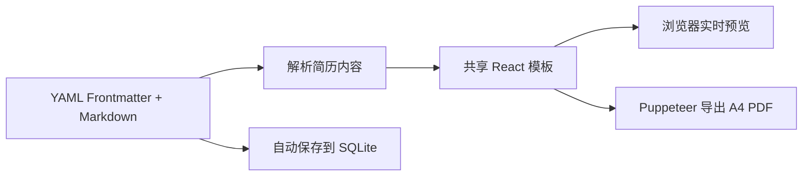

# Resumer

个人使用的本地 Markdown 简历构建工具。通过 YAML Frontmatter + Markdown 维护简历内容，在浏览器中实时预览不同排版，并导出 A4 PDF。

项目以本地使用为主要场景：数据保存在 SQLite，未配置 GitHub OAuth 时可直接使用开发模式登录。

## 功能

- 使用 YAML Frontmatter 管理姓名、职位、简介、联系方式和技能，`basics` 可附加性别/学历等自定义键值信息，使用 Markdown 编写经历正文。
- 新建、切换、复制和删除多份简历。
- 输入停止 1 秒后自动保存，也可使用 `Cmd/Ctrl + S` 手动保存。
- 编辑、分屏、预览三种工作模式。
- 浏览器实时预览与 PDF 导出共用同一套 React 模板组件。
- 10 套模板：极简、科技、开发者、网格、编辑、商务、紧凑、账本、沉静、蓝图。
- 内置 8 套经过搭配的配色方案，并可自定义配色、字体、字号、行高、页边距和照片排版。
- 导入和导出 Markdown。
- 预览角落显示页数与一页适配提示：单页时给出剩余行数，第 2 页只有几行时高亮提醒可收进一页。
- 上传头像或照片；图片以 base64 数据 URL 保存在 SQLite 中，单张最大 2 MB。
- 使用 Puppeteer 和本地 Chrome/Chromium 导出 A4 PDF。
- 改写 V2：贴岗位 JD 或写一句方向，建议稿显示在右侧预览，核对后再另存为新简历。底稿保持不变。需要配置 `DEEPSEEK_API_KEY`。主导等强主张不能比底稿增加。
- 变体溯源：改写另存与手动复制的简历自动挂到同一母本下，简历列表按母本分组展示变体并附带来源摘要。
- 历史版本：手动保存（Cmd/Ctrl + S）立即留档，平时编辑每 5 分钟自动留档，每份简历保留最近 20 份；恢复前会先把当前内容留档，可反复退回。

## 工作流



## 模板

| ID | 名称 | 适用方向 |
|---|---|---|
| `minimal` | 极简 | 留白克制的衬线编辑风 |
| `tech` | 科技 | 深色 Banner 与等宽字体，适合工程师 |
| `developer` | 开发者 | 高信息密度、项目卡片化 |
| `grid` | 网格 | 瑞士网格排版，适合设计和产品方向 |
| `editorial` | 编辑 | 杂志感衬线排版，适合文字和创意方向 |
| `executive` | 商务 | 稳重留白与金色细节，适合管理和咨询方向 |
| `compact` | 紧凑 | 小页边距高密度，适合内容较多的一页简历 |
| `ledger` | 账本 | 瑞士精密排版和编号侧栏，适合高级工程师 |
| `authority` | 沉静 | 象牙纸、森林墨与黄铜细节，适合资深和管理方向 |
| `blueprint` | 蓝图 | 技术文档式网格和钴蓝标注，适合系统型工程师 |

## 技术栈

- Next.js 16（App Router）
- React 19 + TypeScript
- Tailwind CSS 4
- NextAuth.js v4 + GitHub OAuth / Credentials 开发登录
- better-sqlite3
- Puppeteer Core
- yaml + react-markdown + remark-gfm
- Zod

## 本地开发

### 1. 安装依赖

需要 Node.js 20.9 或更高版本，以及本机 Chrome/Chromium。

```bash
npm install
```

### 2. 配置环境变量

```bash
cp .env.example .env.local
```

至少需要将 `NEXTAUTH_SECRET` 替换为本地随机值：

```bash
openssl rand -base64 32
```

常用配置：

| 变量 | 说明 |
|---|---|
| `NEXTAUTH_URL` | 本地地址，默认 `http://localhost:3000` |
| `NEXTAUTH_SECRET` | NextAuth.js 会话密钥 |
| `GITHUB_ID` / `GITHUB_SECRET` | 可选；配置后使用 GitHub OAuth，否则启用开发登录 |
| `DATABASE_URL` | SQLite 文件路径，默认 `./data/resumer.db` |
| `PUPPETEER_EXECUTABLE_PATH` | Chrome/Chromium 可执行文件路径 |
| `DEEPSEEK_API_KEY` | 可选；配置后可使用「改写」 |
| `DEEPSEEK_MODEL` | 可选；默认 `deepseek-v4-flash` |

macOS 的 Chrome 默认路径是：

```text
/Applications/Google Chrome.app/Contents/MacOS/Google Chrome
```

### 3. 启动

```bash
npm run dev
```

访问 [http://localhost:3000](http://localhost:3000)。未配置 GitHub OAuth 时，在登录页输入一个本地用户名即可进入。

## 简历格式

```markdown
---
name: 张三
title: 高级前端工程师
summary: 简短自我介绍
contact:
  phone: 138****8888
  email: zhangsan@example.com
  github: github.com/zhangsan
  website: zhangsan.dev
skills:
  - React
  - TypeScript
---

## 工作经历

### 公司 | 职位 | 2020.01 - 至今

- 职责与成果
```

完整字段、正文结构和模板差异见 [RESUME_MARKDOWN_RULES.md](./RESUME_MARKDOWN_RULES.md)。

## 项目结构

```text
app/                    Next.js App Router 页面与 Route Handlers
  api/
    auth/               NextAuth.js 路由
    export/pdf/         PDF 导出 API
    resumes/            简历 CRUD API
  page.tsx              登录页和编辑器入口
components/             编辑器、预览、模板选择和样式面板
lib/
  auth.ts               登录与会话配置
  db.ts                 SQLite 连接与初始化
  parser.ts             YAML Frontmatter / Markdown 解析
  pdf.ts                Puppeteer PDF 渲染
  templates/            预览和 PDF 共用的模板组件及样式
  types.ts              Schema、类型和默认简历内容
scripts/                模板渲染、PDF 和多简历验收脚本
```

## 检查与验证

```bash
npm run lint
npm run build
npm test
npx tsx scripts/test-render.tsx
node scripts/test-all-pdfs.mjs
```

`test-all-pdfs.mjs` 会将所有模板的测试 PDF 写入系统临时目录，不会修改仓库内容。

## 可选 Docker 运行

仓库保留了 Docker 配置，适合希望在容器中运行本地工具的场景：

```bash
docker compose up --build
```

首次构建会安装 Chromium，耗时会比直接本地启动更长。SQLite 数据挂载在仓库的 `data/` 目录。

## 后续候选

- 简历版本历史
- 自定义 CSS
- 本地备份与恢复
