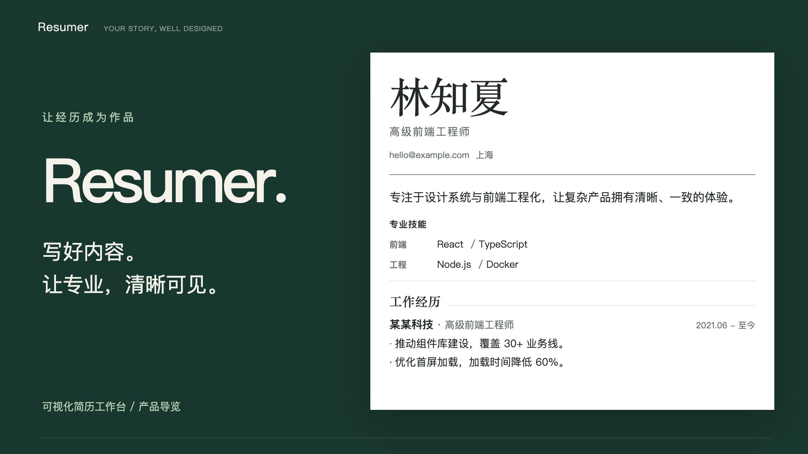
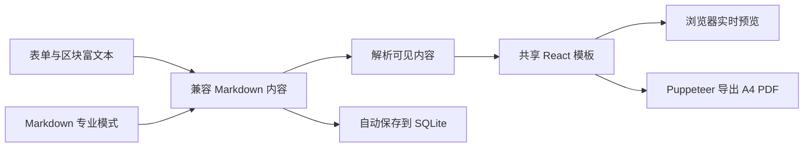

# Resumer

个人使用的本地简历工作台。默认通过简历目录、成品画布和区块编辑面板整理内容，实时预览不同排版并导出 A4 PDF；保留 Markdown 专业模式。

项目以本地使用为主要场景：数据保存在 SQLite，未配置 GitHub OAuth 时可直接使用开发模式登录。

## 48 秒了解 Resumer

[](docs/media/resumer-intro.mp4)

▶ [观看带配乐的项目介绍](docs/media/resumer-intro.mp4) · 48 秒 / 1080p / 原创轻电子配乐。展示公开示例内容，照片人物为虚构示例。

[Remotion 源码与重新生成说明](video/README.md)

## 功能

- 使用 YAML Frontmatter 管理姓名、职位、简介、联系方式和技能，`basics` 可附加性别/学历等自定义键值信息（值会并入联系方式区，全部模板均会展示），使用 Markdown 编写经历正文。
- 新建、切换、复制和删除多份简历。
- 输入停止 1 秒后自动保存，也可使用 `Cmd/Ctrl + S` 手动保存。
- 默认可视化编辑：基本信息表单、技能分类、经历字段与轻量富文本；点击画布中的唯一标题可定位对应区块。
- 区块支持添加、上下移动、隐藏和删除；结构操作提供即时撤销。
- Markdown 专业模式保留编辑、分屏、预览三种视图。
- 浏览器实时预览与 PDF 导出共用同一套 React 模板组件。
- 5 套重新设计的成品主题：留白、纸刊、序列、沉静、构筑。
- 内置 8 套经过搭配的配色方案，并可自定义配色、字体、字号、行高、页边距和照片排版。
- 导入和导出 Markdown。
- 本地备份与恢复：导出当前账户的简历、照片、历史版本及变体关系；恢复为新增简历，支持跨账户或换电脑迁移。
- 预览角落显示页数与一页适配提示：单页时给出剩余行数，第 2 页只有几行时高亮提醒可收进一页。
- 在设计面板上传、更换、移除和调整照片；更多操作保留快捷入口。上传头像或照片；图片以 base64 数据 URL 保存在 SQLite 中并按内容哈希去重（简历与其全部历史快照共享同一份存储），单张最大 2 MB。
- 五套主题各自适配照片构图；支持标准照片、强化肖像、填满裁切、完整显示和垂直取景调节，无照片时自动使用完整的文字版式。
- 使用 Puppeteer 和本地 Chrome/Chromium 导出 A4 PDF。
- 改写 V2：贴岗位 JD 或写一句方向，建议稿显示在右侧预览，核对后再另存为新简历。底稿保持不变。需要配置 `DEEPSEEK_API_KEY`。主导等强主张不能比底稿增加。
- 建议稿显示期间可「另存后导出」，也可明确选择「导出底稿」；PDF 失败后可就地重试，已另存的简历不会重复创建。
- 变体溯源：改写另存与手动复制的简历自动挂到同一母本下，简历列表按母本分组展示变体，并显示来源摘要、更新时间和当前标识。
- 历史版本：选择版本可先查看包含原主题和照片的只读成品预览，再恢复；恢复前先保存最新编辑。手动保存（Cmd/Ctrl + S）立即留档，平时编辑每 5 分钟自动留档，每份简历保留最近 20 份；恢复前会先把当前内容留档，可反复退回。

桌面设计和改写面板与清晰画布并列；窄屏可切换设置与效果。手机编辑默认使用完整宽度，按需打开目录。具体交互约定见 [产品设计记录](docs/product.md)。

## 可视化编辑与兼容

现有简历无需迁移。可视化编辑在原内容之上操作，未编辑的区块保留原始 Markdown，修改基本信息时保留未知 YAML 字段。表格、代码、图片等复杂内容使用区块内的原格式编辑器，不自动降级成富文本。

隐藏的经历或区块以 `resumer-hidden-2` / `resumer-hidden-3` HTML 注释保存在 Markdown 中，恢复显示时解码还原；预览和 PDF 解析会移除这些注释。它是可逆的显示设置，不是删除或保密措施，导出的 Markdown 仍包含隐藏内容。相同标题无法唯一定位时，请从左侧目录选择。AI 改写继续采用整份建议稿、另存变体的流程。

## 工作流


```mermaid
flowchart LR
  V["表单与区块富文本"] --> A["兼容 Markdown 内容"]
  M["Markdown 专业模式"] --> A
  A --> B["解析可见内容"]
  B --> C["共享 React 模板"]
  C --> D["浏览器实时预览"]
  C --> E["Puppeteer 导出 A4 PDF"]
  A --> F["自动保存到 SQLite"]
```

## 模板

| ID | 名称 | 适用方向 |
|---|---|---|
| `minimal` | 留白 | 舒展单栏，衬线姓名与清晰的专业信息 |
| `editorial` | 纸刊 | 暖白杂志分栏，右侧资料栏与左侧经历主栏 |
| `ledger` | 序列 | 瑞士编号索引，严谨对齐与陶红细节 |
| `authority` | 沉静 | 居中名帖，松墨色、轻底色简介与舒展正文 |
| `blueprint` | 构筑 | 墨蓝页首，左侧资料栏与精简的技术档案排版 |

旧主题自动对应：`tech` / `developer` → `blueprint`，`grid` → `ledger`，`executive` → `authority`，`compact` → `minimal`。预览、编辑器和 PDF 共用同一解析规则。旧默认外观会升级，实际调整过的配色、字号和页边距会保留；保存后用 `collectionVersion: 2` 标记，避免重复迁移。由 `legacy-defaults.ts` 统一保证历史版本的平滑升级与兼容。

## 技术栈

- Next.js 16（App Router）
- React 19 + TypeScript
- Tailwind CSS 4
- NextAuth.js v4 + GitHub OAuth / Credentials 开发登录
- better-sqlite3
- Puppeteer Core
- Tiptap + Markdown 扩展
- yaml + unified + remark-parse + react-markdown + remark-gfm
- Zod

> NextAuth.js 固定在 v4（其 peerDependencies 已声明支持 Next 16 与 React 19）。继任者 Auth.js v5
> 目前仍为 beta，待正式发布后升级：`getServerSession(authOptions)` 将替换为 `auth()`，
> `lib/auth.ts` 与各路由的会话获取是唯一需要改动的位置。

## 本地开发

### 1. 安装依赖

需要 Node.js 20.9 或更高版本，以及本机 Chrome/Chromium。

```bash
npm install
```

### 2. 配置环境变量

```bash
cp .env.example .env.local
```

至少需要将 `NEXTAUTH_SECRET` 替换为本地随机值：

```bash
openssl rand -base64 32
```

常用配置：

| 变量 | 说明 |
|---|---|
| `NEXTAUTH_URL` | 本地地址，默认 `http://localhost:3000` |
| `NEXTAUTH_SECRET` | NextAuth.js 会话密钥 |
| `GITHUB_ID` / `GITHUB_SECRET` | 可选；配置后使用 GitHub OAuth，否则启用开发登录或访问口令 |
| `AUTH_PASSWORD` | 可选；单人私有部署时设置访问口令，避免在生产模式被他人免密登录 |
| `DATABASE_URL` | SQLite 文件路径，默认 `./data/resumer.db` |
| `PUPPETEER_EXECUTABLE_PATH` | Chrome/Chromium 可执行文件路径 |
| `DEEPSEEK_API_KEY` | 可选；配置后可使用「改写」 |
| `DEEPSEEK_MODEL` | 可选；默认 `deepseek-v4-flash` |

macOS 的 Chrome 默认路径是：

```text
/Applications/Google Chrome.app/Contents/MacOS/Google Chrome
```

### 3. 启动

```bash
npm run dev
```

访问 [http://localhost:3000](http://localhost:3000)。未配置 GitHub OAuth 时，在登录页输入一个本地用户名即可进入。

## 简历格式

```markdown
---
name: 张三
title: 高级前端工程师
summary: 简短自我介绍
contact:
  phone: 138****8888
  email: zhangsan@example.com
  github: github.com/zhangsan
  website: zhangsan.dev
skills:
  - React
  - TypeScript
---

## 工作经历

### 公司 | 职位 | 2020.01 - 至今

- 职责与成果
```

完整字段、正文结构、五套主题与照片适配、AI 改写保护见 [内容生成与成品适配规范](./RESUME_MARKDOWN_RULES.md)。AI 改写会读取这份规范；隐藏区块标记的丢失、篡改、复制或重排会被提交校验拒绝。

## 项目结构

```text
app/                    Next.js App Router 页面与 Route Handlers
  api/
    auth/               NextAuth.js 路由
    export/pdf/         PDF 导出 API
    resumes/            简历 CRUD API
  page.tsx              登录页和编辑器入口
components/             编辑器、预览、模板选择和样式面板
lib/
  auth.ts               登录与会话配置
  db.ts                 SQLite 连接与初始化
  parser.ts             YAML Frontmatter / Markdown 解析
  pdf.ts                Puppeteer PDF 渲染
  templates/            预览和 PDF 共用的模板组件及样式
  types.ts              Schema、类型和默认简历内容
scripts/                模板渲染、PDF 和多简历验收脚本
```

## 检查与验证

```bash
npm run lint
npm run build
npm test
npx tsx scripts/test-render.tsx
node scripts/test-all-pdfs.mjs
```

`test-all-pdfs.mjs` 会将所有模板的测试 PDF 写入系统临时目录，不会修改仓库内容。

构建完成后，可运行 `node scripts/test-backup.mjs` 验证备份与恢复的页面流程。脚本自行启动独立端口的生产服务，使用临时数据库与本地测试账户，验证下载、保存、无效文件、恢复和列表刷新，结束后清理，不读写现有简历。需要本机 Chrome/Chromium。

`node scripts/test-design-flows.mjs` 使用临时数据库和确定性建议稿，检查历史预览与恢复、保存和另存失败、重复点击，以及 PDF 失败后的重试；实际调用 PDF 渲染器，不调用 AI。截图与 PDF 保存在系统临时目录的 `resumer-design-flows/`。同样需要先构建及本机 Chrome/Chromium。

## 可选 Docker 运行

仓库保留了 Docker 配置，适合希望在容器中运行本地工具的场景：

```bash
docker compose up --build
```

首次构建会安装 Chromium，耗时会比直接本地启动更长。SQLite 数据挂载在仓库的 `data/` 目录。

## 本地备份与恢复

在顶栏「更多操作 → 备份与恢复」中下载 JSON 备份。下载前会等待当前简历保存成功，备份包含当前账户的全部简历内容、隐藏区块、模板与样式设置、照片、历史版本及变体来源关系。照片按内容去重，历史版本的时间与顺序保留。

在目标电脑登录后，从同一入口选择备份文件，核对数量并点击「确认新增恢复」。恢复会重新分配 ID，将数据归入当前账户，不覆盖已有简历，也不切换或清空当前编辑内容。重复恢复会再次新增副本；母本已删除的变体继续作为独立条目保留。格式、引用关系和照片哈希校验失败时拒绝恢复；写入失败则整批回滚。

网页备份文件最大 100 MB。备份是未加密的完整个人数据文件，请妥善保管。它不包含登录账户、密钥、环境配置和尚未另存的 AI 改写会话；已另存的改写简历与来源说明会包含在内。历史版本仍按每份简历最近 20 份的现有规则在后续保存时维护。

## 后续候选

- 自定义 CSS
